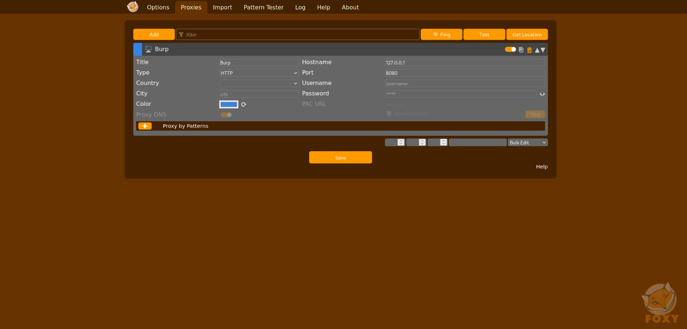
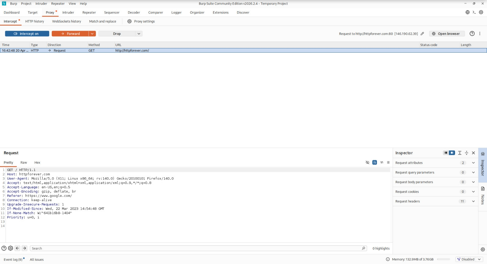
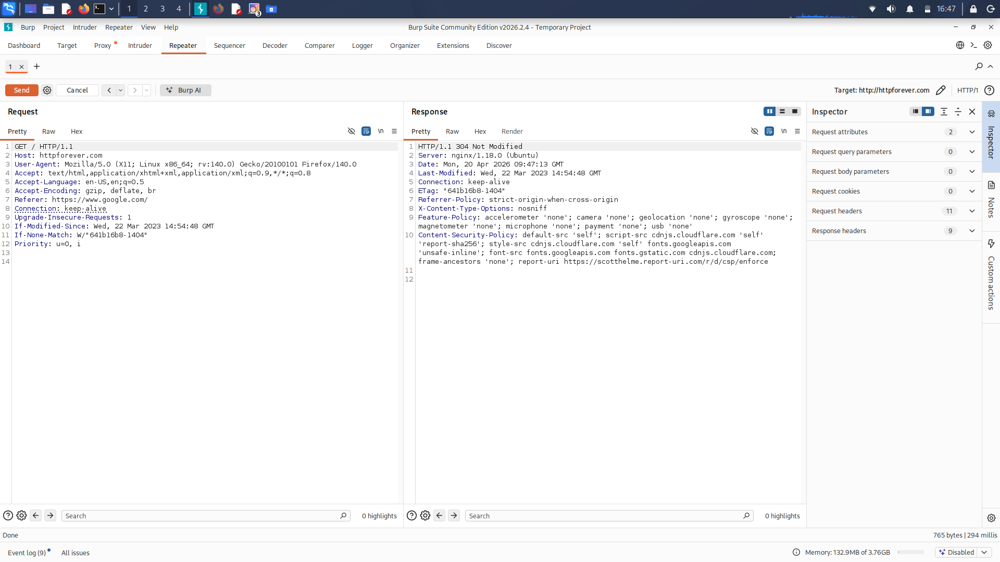

# Lab: Web Traffic Analysis with Burp Suite

This lab covers the essential steps for intercepting and analyzing web traffic. The goal is to establish a working proxy environment between the browser and Burp Suite.

## Setup & Workflow
- **Proxy:** Configured FoxyProxy to route traffic through `127.0.0.1:8080`.
- **Interception:** Captured HTTP requests from `http://httpforever.com` to analyze headers and parameters.
- **Manipulation:** Utilized the Repeater module to send modified requests and analyze responses.

## Visual Documentation

### 1. FoxyProxy Configuration
Browser proxy settings for routing traffic.

### 2. Traffic Interception
Captured a GET request. This confirms the connection between the browser and Burp Suite is working.

### 3. Request Manipulation (Repeater)
Verified that requests are successfully sent to the Repeater and responses are received.

## Conclusion
The environment is fully functional. The setup allows for capturing traffic and performing manual request manipulation using the Repeater module.
